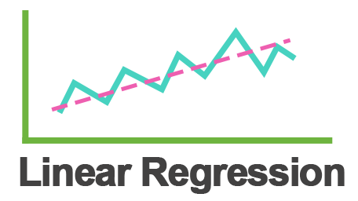
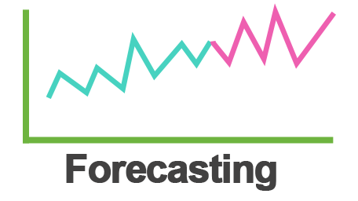
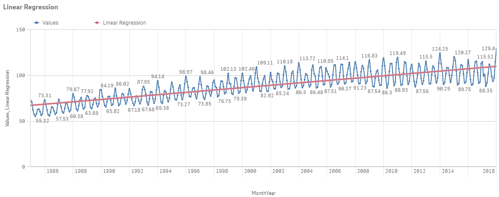
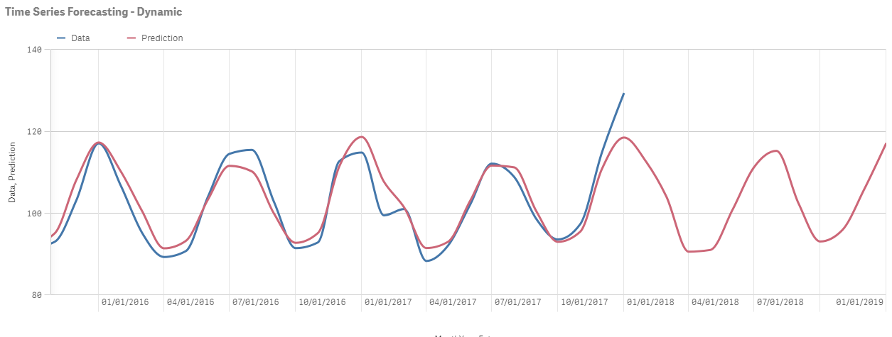
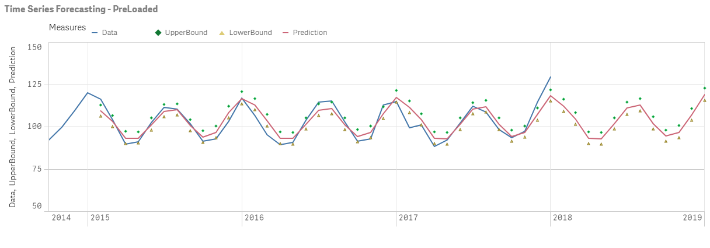

# SSEPython - Plugin for Qlik

## About
Plugin to add machine learning capabilities in Qlik usine SSE( Server Side Extension)

## Setup

### Qlik Sense Desktop

1) Install Qlik Sense Desktop (June 2017 release or later).
2) Make sure you have Python 3.4 (or later) installed as well as the grpcio package.
3) Add SSEPlugin=SSEPython,localhost:50052 on a new line in your Settings.ini file located at C:\Users\[user]\Documents\Qlik\Sense or C:\user\[user]\AppData\Local\Programs\Qlik\Sense\Engine.
4) Copy the .qvf file from the selected example folder to C:\Users\[user]\Documents\Qlik\Sense\Apps.
5) Run the corresponding SSEPython.py package.
6) Start Qlik Sense Desktop and open the app for the examples.

### Qlik Sense Enterprise

1) Install Qlik Sense Enterprise (June 2017 release or later).
2) Make sure you have Python 3.4 (or later) installed as well as the grpcio package.
3) Add the SSE plugin settings in QMC under Analytic connections by inserting the following values: name:SSEPython, host: localhost, port:50052
4) Add the .qvf file from the selected example folder to QMC.
5) Run the corresponding SSEPython.py python package.
6) Start Qlik Sense Enterprise and open the app for the examples.

## Output Samples

## Capability Call from Qlik

## Code Samples

Link to Plugin Code - [SSEPython.py](main/SSEPython.py)

### Linear Regression

### Time Series Forecasting Using Prophet

### Time Series Forecasting Using Prophet - Multi Fields

### Plugin Function Declaration JSON

### Qlik BundleRow Sample Data

